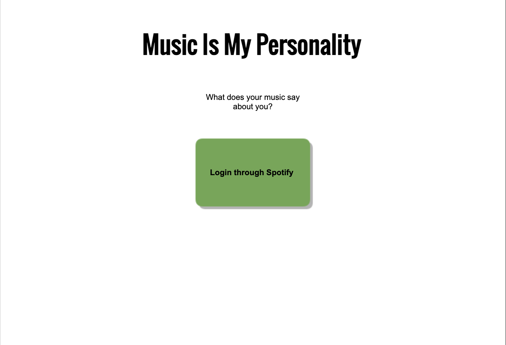
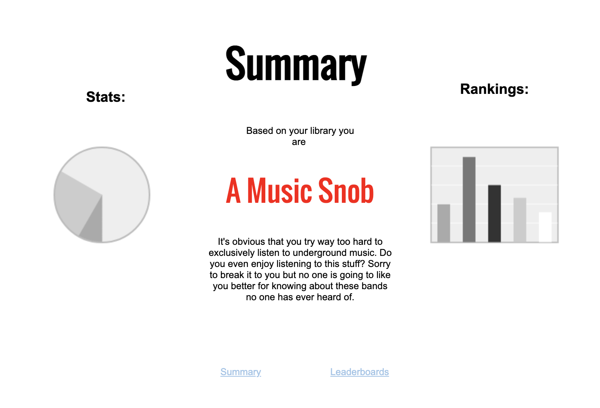
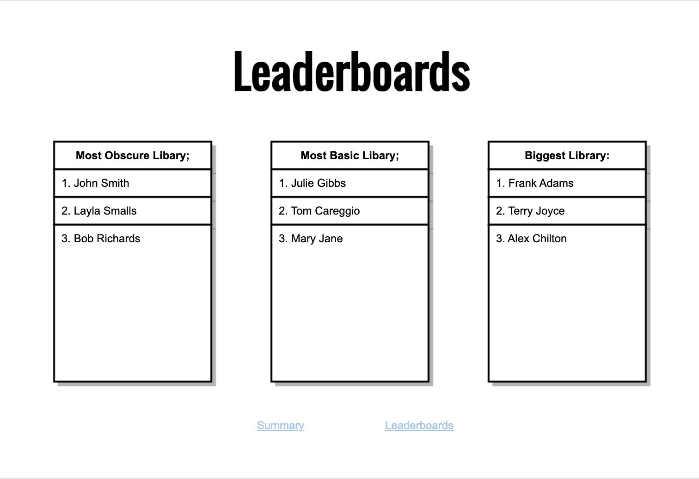

# Music Is My Personality

## Overview

Are you worried you're too much of an insufferable music snob? Or maybe the opposite and instead feel like you're just too basic because every song you listen to is a TikTok trend? Music Is My Personality will give you the bitter truth of what kind of personality you have based on your music taste.

Music Is My Personality is a web app that analyzes the music libary of Spotify users. Every user will be given a report with statistics describing how obscure or popular their library is. Additionally, a consensus based on the analysis will be shown, telling the user what kind of person they are.


## Data Model

The application will store Users, Summaries, and Leaderboard

* users will have a list of stats that is calculated 
  by comparing their library to the most popular music on spotify, 
  a list of rankings for each stat, and a summary based on the stats.
* summaries will contain a string have a funny response to the user's data..

An Example User:

```javascript
{
  username: "joshforlenza",
  spotifyID:, // id used for getting user data from Spotify API
  authToken:, // String used for Spotify authentication
  bio:, // an object containing a user bio
  favoriteAlbums:, // an object with favoriteAlbums as keys and String names as values
  stats:, // an array of objects with stat type as key and a percent as value
  summary: //reference to a Summary object
}
```

An Example Summary:

```javascript
{
  name: "musicSnob",
  description: "It's obvious that you try way too hard to exclusively listen to underground music. Do you even enjoy listening to this stuff? Sorry to break it to you but no one is going to like you better for knowing about these bands no one has ever heard of."
}
```


## [Link to Schema](db.mjs) 

## Wireframes

/ - homepage



/summary - page for user's music summary



/leaderboards - page for showing leaderboards



## Site map


## User Stories or Use Cases

1. as a Spotify user, I can log in to the site
2. as a user, I can look at a summary of my music library
3. as a user, I can look at leaderboards of other users
4. as a user, I can create a profile page and look at other profile pages

## Research Topics

* (5 points) Spotify Web API
    * I'm going to be using Spotify API for user login and data
    * The API allows authentication of a user
    * Also it will give me the necessary user data to generate a summary based on the user's library
    * The API will also allow me to retrieve data on Spotify total content which will allow to generate user statistics 
    * see <code> https://developer.spotify.com/documentation/web-api/reference/#/</code> for documentation
* (3 points) Mocha
    * Unit testing
    * Will make testing my code easier
    * Will use it to ensure user summary is displayed correct
    * see <code> https://mochajs.org/</code> for documentation
* (2 points) Boostrap
    * CSS framework
    * I want to use this because I have no prior experience with CSS
    * I care about the aesthetic of the website, and I think will help me in creating an interesting theme 
    * see <code> https://getbootstrap.com/docs/5.2/getting-started/introduction/</code> for documentation

10 points total out of 8 required points


## [Link to Main Project File](app.mjs) 

## Annotations / References Used

